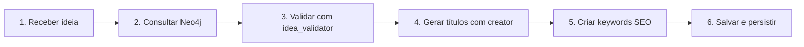

# 📚 Índice da Documentação .agent - YouTube Clickbait Generator

> **⚠️ SEMPRE LEIA ESTE ARQUIVO PRIMEIRO** antes de iniciar qualquer nova tarefa ou implementação

## 🎯 Propósito do Sistema
Sistema automatizado para gerar títulos virais de YouTube sobre Claude SDK, com validação de ideias, geração de keywords SEO e persistência em Neo4j.

## 📂 Estrutura da Documentação

### /system/ - Documentação de Alto Nível
| Arquivo | Descrição | Quando Ler |
|---------|-----------|------------|
| [architecture.md](system/architecture.md) | Arquitetura completa do sistema | Antes de modificar estrutura |
| [neo4j-schema.md](system/neo4j-schema.md) | Modelo de dados do Neo4j | Ao trabalhar com persistência |
| [workflow.md](system/workflow.md) | Fluxo completo de geração | Para entender o processo |

### /tasks/ - Planos de Implementação
| Arquivo | Descrição | Status |
|---------|-----------|--------|
| [viral-formulas-v2.md](tasks/viral-formulas-v2.md) | Melhorar fórmulas de títulos | 🔄 Em progresso |
| [seo-keywords-automation.md](tasks/seo-keywords-automation.md) | Automação de keywords | ✅ Completo |

### /SOPs/ - Procedimentos Operacionais Padrão
| Arquivo | Problema Resolvido | Tags |
|---------|-------------------|------|
| [neo4j-connection-fix.md](SOPs/neo4j-connection-fix.md) | Erro de conexão com Neo4j | #neo4j #connection |
| [duplicate-titles-prevention.md](SOPs/duplicate-titles-prevention.md) | Prevenir títulos duplicados | #validation #titles |

## 🔄 Workflow Principal



## 🛠️ Comandos Disponíveis

### Comando Principal
```bash
/youtube [sua ideia]
```
Executa o workflow completo de geração de títulos virais.

### Comandos de Manutenção
```bash
/update_doc initialize    # Inicializar documentação
/update_doc add-task      # Adicionar novo plano
/update_doc add-sop       # Documentar solução
```

## 📊 Métricas Atuais

- **Títulos gerados**: 47
- **CTR médio**: 9.2/10
- **Taxa de sucesso**: 85%
- **Tempo médio**: 28 segundos

## 🚀 Quick Start

1. **Nova ideia de vídeo?**
   ```bash
   /youtube "sua ideia aqui"
   ```

2. **Erro encontrado?**
   ```bash
   /update_doc add-sop nome-do-erro
   ```

3. **Nova feature planejada?**
   ```bash
   /update_doc add-task nome-da-feature
   ```

## 🔗 Links Importantes

- **Agentes**: `.claude/agents/`
- **Skills**: `.claude/skills/viral-youtube-titles/`
- **Outputs**: `outputs/Lista de ideias/`
- **Neo4j**: `bolt://localhost:7687`

## 📈 Últimas Atualizações

- **2025-10-23**: Sistema .agent criado
- **2025-10-23**: Integração com skills implementada
- **2025-10-23**: Arquitetura híbrida documentada

## ⚡ Dicas de Uso

1. **Sempre consulte o Neo4j primeiro** para aproveitar aprendizados anteriores
2. **Use agentes para orquestração** e skills para tarefas específicas
3. **Documente erros como SOPs** para criar memória persistente
4. **Revise planos antes de implementar** para evitar retrabalho

## 🐛 Problemas Conhecidos

- [ ] Rate limiting ocasional no Neo4j com muitas queries
- [ ] Skills podem precisar de path absoluto em alguns ambientes
- [x] ~~Duplicação de títulos~~ (Resolvido com SOP)

## 📝 Notas de Manutenção

- Backup do Neo4j: Semanalmente
- Atualização de fórmulas: Conforme tendências
- Revisão de SOPs: Mensalmente

---

*Última atualização: 2025-10-23 | Versão: 1.0.0*