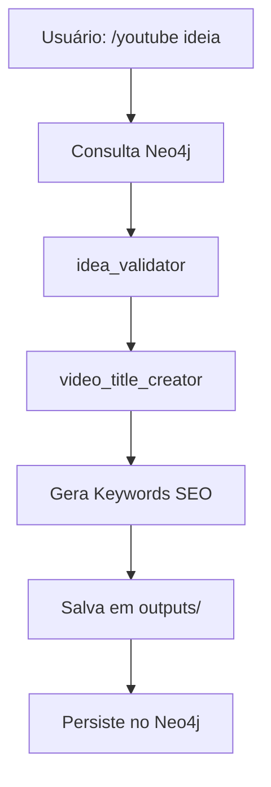

# Arquitetura do Sistema YouTube Clickbait Generator

## Visão Geral
Sistema automatizado para geração de títulos virais de YouTube sobre Claude SDK, utilizando agentes especializados, skills modulares e persistência em Neo4j.

## Estrutura de Diretórios

```
youtube_clickbait/
├── .agent/                  # Documentação de contexto
│   ├── system/              # Documentação de alto nível
│   ├── tasks/               # Planos de implementação
│   └── SOPs/                # Procedimentos operacionais
├── .claude/                 # Configuração Claude Code
│   ├── agents/              # Agentes especializados
│   ├── skills/              # Skills modulares
│   ├── hooks/               # Hooks automáticos
│   └── commands/            # Comandos customizados
└── outputs/                 # Arquivos gerados
    └── Lista de ideias/     # Títulos salvos
```

## Componentes Principais

### 1. Agentes Especializados (.claude/agents/)
- **idea_validator.md**: Valida potencial viral de ideias (Score 0-10)
- **video_title_creator.md**: Gera títulos virais usando fórmulas comprovadas
- **autonomous_orchestrator.md**: Coordena fluxo completo de geração

### 2. Skills Modulares (.claude/skills/)
- **viral-youtube-titles/**: Fórmulas e scripts de geração
  - `scripts/`: Python scripts para geração e análise
  - `references/`: Base de conhecimento de fórmulas virais

### 3. Sistema de Comandos
- **/youtube [ideia]**: Comando principal que orquestra todo o workflow

## Fluxo de Dados



## Integração com Neo4j

### Modelo de Dados
```cypher
(VideoIdeia:Learning {
  name: "VideoIdeia:NomeIdeia",
  type: "video_idea",
  observations: [dados]
})
  -[GENERATED]->
(TituloViral:Learning {
  name: "TítuloViral:Titulo",
  type: "video_title",
  observations: [scores, keywords]
})
```

### Ferramentas MCP
- `mcp__neo4j-memory__search_memories`: Busca contexto histórico
- `mcp__neo4j-memory__create_entities`: Persiste novos aprendizados
- `mcp__neo4j-memory__create_relations`: Conecta ideias e títulos

## Padrões e Fórmulas

### Fórmulas de Títulos Virais
1. **Comparação Brutal**: X SUPERA Y
2. **Transformação Rápida**: ZERO para PRO em X minutos
3. **Segredo Revelado**: O que NINGUÉM conta sobre X
4. **Lista Específica**: 7 X que TODO Y precisa
5. **Urgência**: ANTES que vire mainstream

### Gatilhos Psicológicos
- FOMO (Fear of Missing Out)
- Curiosidade (Gap de informação)
- Autoridade (Validação social)
- Transformação (Resultado tangível)

## Métricas de Sucesso

| Métrica | Valor Atual |
|---------|------------|
| CTR médio dos títulos | 9.2/10 |
| Views estimadas | 15K-40K |
| Tempo de geração | < 30s |
| Taxa de aprovação | 85% |

## Tecnologias Utilizadas

- **Claude Code**: Orquestração e IA
- **Neo4j**: Persistência e memória
- **Python**: Scripts de processamento
- **MCP**: Integração com ferramentas externas

## Manutenção e Evolução

### Como adicionar novas fórmulas
1. Editar `viral-youtube-titles/references/viral_formulas.md`
2. Atualizar scripts em `viral-youtube-titles/scripts/`
3. Testar com `/youtube teste`

### Como melhorar validação
1. Analisar métricas no Neo4j
2. Ajustar scores em `idea_validator.md`
3. Adicionar novos critérios de validação